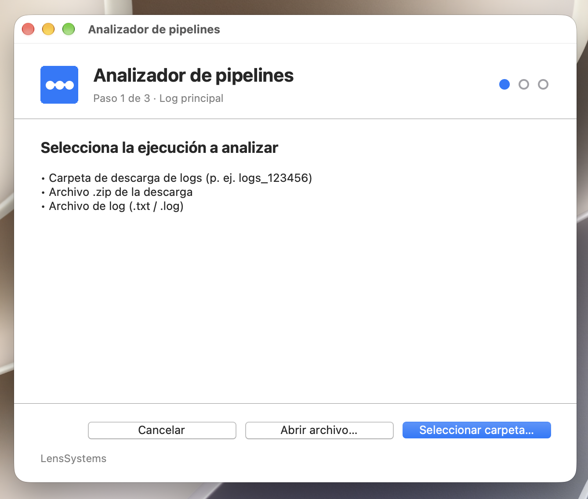
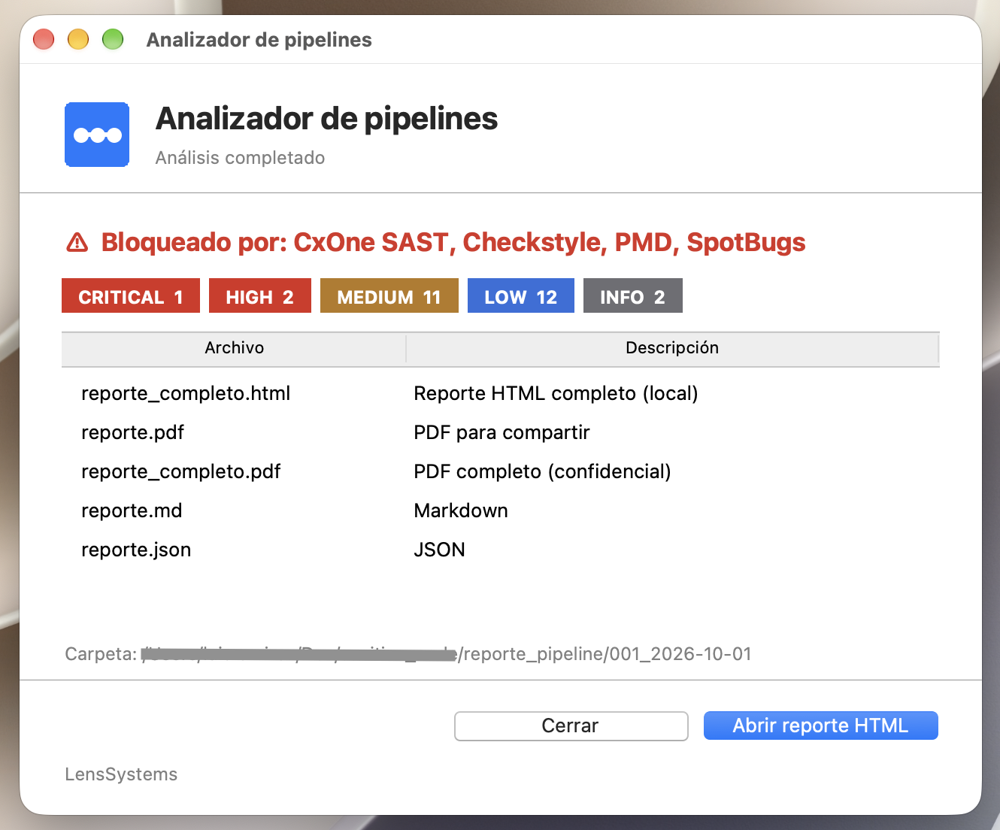
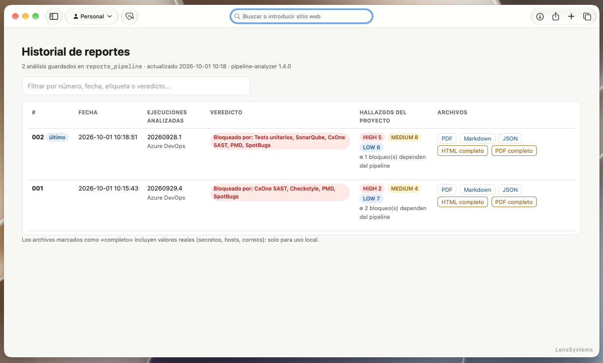

<div align="center">

# pipeline-analyzer

**Analiza logs de CI/CD, encuentra qué impide que tu proyecto pase el pipeline y te dice cómo corregirlo.**

[](https://github.com/LensSystems/pipeline-analyzer/actions/workflows/tests.yml)
[](LICENSE)


</div>

---

<div align="center">



</div>

`pipeline-analyzer` lee los logs de tus ejecuciones de **Azure DevOps, GitHub Actions, GitLab CI, Jenkins** (o cualquier log de texto), detecta problemas de **build, calidad y seguridad**, los ordena en una **ruta para pasar el pipeline** con sus comandos de corrección y **compara ejecuciones** para mostrar qué mejoró, qué empeoró y qué sigue pendiente.

Está escrito solo con la **biblioteca estándar de Python**: no hay nada que instalar y **tus logs nunca salen de tu equipo**.

## Contenido

- [Qué problema resuelve](#qué-problema-resuelve)
- [Características](#características)
- [Inicio rápido](#inicio-rápido)
- [Uso](#uso)
- [Qué genera](#qué-genera)
- [Qué detecta](#qué-detecta)
- [Privacidad y seguridad](#privacidad-y-seguridad)
- [Instalación y compatibilidad](#instalación-y-compatibilidad)
- [Arquitectura](#arquitectura)
- [Desarrollo](#desarrollo)
- [Limitaciones](#limitaciones)
- [Contribuir](#contribuir)
- [Licencia y autoría](#licencia-y-autoría)

## Qué problema resuelve

Cuando un pipeline falla, el log tiene miles de líneas, varias herramientas (tests, SonarQube, CxOne, PMD, SpotBugs…) y no siempre queda claro **qué es culpa de tu código y qué depende de quien administra el pipeline**. `pipeline-analyzer` automatiza ese análisis:

1. Extrae métricas de cada herramienta **por su contenido**, sin depender de los nombres de los pasos.
2. Las convierte en hallazgos con severidad, evidencia, causa probable, pasos y comandos.
3. **Separa lo que puedes corregir tú de lo que debe resolver el equipo del pipeline**, y enlaza ambos cuando uno bloquea al otro (por ejemplo, un contenedor Docker huérfano que impide correr PMD).
4. Compara ejecuciones y deja un historial de todos los análisis.

## Características

- **Multi-proveedor:** Azure DevOps (carpeta o `.zip` de la descarga), GitHub Actions, GitLab CI, Jenkins y logs genéricos. El proveedor se detecta solo.
- **Ruta para pasar el pipeline:** pasos ordenados (desbloquear el pipeline, tests, análisis estático, Sonar, seguridad), cada uno con su criterio de «listo cuando» y los comandos para validar en local.
- **Comparativa entre ejecuciones:** tabla *Antes · Ahora · Cambio* con lo que cambió primero (y la diferencia) y, al final, lo que sigue igual, y hallazgos *resueltos, nuevos, pendientes* o *no verificables*. El botón **Solo comparación** genera únicamente esto.
- **Seguridad:** secretos en claro, TLS deshabilitado, `curl | bash`, imágenes `:latest`, ramas mutables, CVE conocidos, manifiestos de Kubernetes, definición del pipeline y `pom.xml`.
- **Detalle exacto por herramienta:** con los reportes XML/JSON de PMD, Checkstyle, SpotBugs y CxOne (JSON o el **PDF/Scan Report descargado de Checkmarx**, que se cruza con el log y propone la solución de cada hallazgo) muestra regla, archivo y línea.
- **Resultados de CxOne completos:** tabla del *Scan Summary* del log con todos los motores (SAST, SCA, SCS, IaC, APIs, Containers), total, Secret Detection y Scorecard; los motores que no corrieron se muestran como «no ejecutado».
- **Reporte de Checkmarx (PDF o Markdown):** lee cada resultado SAST y SCA, propone la solución (con ejemplo para Java/Spring/Maven), indica si parece falso positivo o problema real y comprueba que sea **el mismo escaneo** que el log (ID, rama, hora y estado de cada motor).
- **Revisión completa de lo compartido:** al pasar una carpeta o un `.zip` se buscan reportes en todos sus archivos y el reporte lista qué se leyó y qué se ignoró.
- **Reportes:** consola, HTML, PDF, Markdown y JSON, cada uno en versión para compartir (secretos enmascarados) y versión completa de uso local.
- **Historial:** cada análisis se guarda en su propia carpeta numerada y se genera un `historial-reportes.html`.
- **Interfaz:** línea de comandos, ventanas nativas (tkinter) con aspecto propio de macOS, Windows 11 y Windows 10, con una sola pantalla «Nuevo análisis» en todos los sistemas, o preguntas en consola. Al terminar puedes abrir el reporte sin cerrar la ventana y empezar otro análisis.
- **Multiplataforma y sin dependencias:** macOS, Linux y Windows; Python 3.8 o superior.

## Inicio rápido

```bash
git clone https://github.com/LensSystems/pipeline-analyzer.git
cd pipeline-analyzer

# Asistente interactivo: elige solo el mejor modo (ventanas sin consola → ventanas → consola)
python3 analizar_pipeline.py          # Windows: python analizar_pipeline.py, o doble clic en analizar_pipeline.bat

# O directamente sobre una descarga de logs
python3 -m pipeline_analyzer logs_123456 --pom pom.xml
```

Los reportes quedan en `reporte_pipeline/NNN_AAAA-MM-DD/`. Para abrir el principal:

```text
reporte_pipeline/001_2026-09-30/reporte_completo.html
```

> Si las ventanas no aparecen, ejecuta `python3 analizar_pipeline.py --doctor`: indica el motivo y el comando exacto para habilitarlas en tu sistema.

## Uso

### Modo interactivo (sin argumentos)

```bash
python3 analizar_pipeline.py
```

También puedes hacer doble clic en `analizar_pipeline.command` (macOS) o `analizar_pipeline.bat` (Windows, único archivo de arranque).

**En macOS, Windows y Linux** hay la misma pantalla, **Nuevo análisis**, con cuatro filas:

| Fila | Qué se elige |
|---|---|
| **Log principal** (obligatorio) | Carpeta de descarga (p. ej. `logs_123456`), `.zip` o archivo `.txt`/`.log` |
| **Comparación** | Una o varias ejecuciones anteriores, para ver qué mejoró o empeoró |
| **pom.xml** | Para revisar su configuración de build, calidad y dependencias |
| **Reportes** | PDF de Checkmarx o XML/JSON de PMD, Checkstyle y SpotBugs que no venían en la carpeta o el `.zip` (archivos o una carpeta completa) |

**Un archivo, un solo apartado:** no se puede usar el mismo archivo en dos apartados (ni repetirlo dentro de uno), p. ej. el mismo archivo como comparación, pom y reporte. Si la ruta completa es la misma, aparece «Archivo no válido» y no se agrega. Un archivo con el mismo nombre pero en otra carpeta sí es válido. La consola aplica la misma regla.

**Solo comparación:** cuando hay log principal y al menos una comparación aparece el botón **Solo comparación** (en consola, una pregunta; en la línea de comandos, `--compare-only`). Genera solo el comparativo viejo → nuevo, sin pom ni reportes de herramientas, y los reportes contienen únicamente eso.

Cada elemento agregado tiene su botón naranja **Quitar**; **Analizar** se habilita en cuanto eliges el log principal. La ventana es ancha para que se lean las rutas, se alarga sola al agregar archivos y vuelve a su alto base al quitarlos. Lo único que cambia entre sistemas es el aspecto nativo (ver más abajo) y el orden de los botones.

Después, una ventana muestra el avance (con barra determinada) y, al terminar, el veredicto, los hallazgos por severidad y los archivos generados:

- **Abrir reporte** lo abre en el navegador **sin cerrar la ventana**; puedes abrirlo las veces que quieras. Con doble clic (o Enter) sobre un archivo de la lista también se abre.
- **Nuevo análisis** regresa al inicio para analizar otra ejecución. Se conservan `--pom`, `--reports` y `--out-dir` si los pasaste por línea de comandos.
- **Cerrar** termina el programa.
- Durante el análisis hay un botón **Cancelar** (también cerrar la ventana, o ⌘. en macOS) que pide confirmación antes de detenerlo; en macOS, ⌘W y ⌘Q cierran la ventana.
- La tecla **Esc no cierra ni cancela nada** en ningún sistema.

**Apariencia nativa según el sistema y su versión:** macOS usa los controles Aqua (botón principal azul, modo claro/oscuro del sistema); Windows 11 usa Segoe UI Variable y Windows 10 Segoe UI, con el orden de botones de Windows (el principal a la izquierda); Linux usa el tema `clam`. En Windows y Linux la ventana se ve siempre en modo claro. Sin entorno gráfico (servidor, SSH, Python sin tkinter) se hacen las mismas preguntas en la consola, una por una: log principal, ¿agregar comparación?, ¿agregar `pom.xml`? y ¿agregar reportes de las herramientas? `--no-gui` fuerza este modo y `--gui` abre las ventanas aunque pases rutas.

### Con argumentos

```bash
# Una descarga de logs de Azure DevOps (carpeta o .zip)
python3 -m pipeline_analyzer logs_123456

# Comparar dos ejecuciones y revisar el pom
python3 -m pipeline_analyzer logs_123400 logs_123456.zip --pom pom.xml

# Solo el comparativo viejo → nuevo (sin análisis completo)
python3 -m pipeline_analyzer logs_123400 logs_123456 --compare-only

# Carpeta que agrupa varias descargas logs_* (cada una es una ejecución)
python3 -m pipeline_analyzer descargas/

# Logs combinados de un job (.txt / .log)
python3 -m pipeline_analyzer log_anterior.txt log_actual.txt

# Con los reportes XML/JSON de las herramientas, para ver regla, archivo y línea
python3 -m pipeline_analyzer logs_123456 --pom pom.xml --reports ruta/al/proyecto/target

# Como breaker en CI: código de salida 1 si hay hallazgos HIGH o peores
python3 -m pipeline_analyzer logs_123456 --fail-on HIGH --formats none
```

### Opciones

| Opción | Descripción |
|---|---|
| `logs` | Carpetas `logs_<id>`, `.zip`, logs `.txt`/`.log`, carpetas que los agrupen o globs. **Si se omite, el programa las pide** |
| `--pom` | `pom.xml` a revisar |
| `--dump-pdf PDF` | Muestra el texto que se lee de un PDF de Checkmarx y los hallazgos que se interpretan; sirve para diagnosticar un PDF que no se reconoce |
| `--reports` | Carpeta o archivo con reportes de herramientas (PMD, Checkstyle y SpotBugs en XML; JSON de resultados o PDF descargado de Checkmarx/CxOne). Se puede repetir. También se buscan solos en la carpeta de logs y en el `target/` junto al `pom.xml` |
| `--compare-only` | Solo compara las ejecuciones (viejo → nuevo): qué mejoró, empeoró o cambió y qué hallazgos se resolvieron o aparecieron. No revisa pom ni reportes de herramientas; necesita al menos dos ejecuciones |
| `--labels` | Etiquetas por ejecución, en el mismo orden |
| `--keep-order` | No reordenar las ejecuciones por fecha |
| `--out-dir` | Carpeta base de los reportes (por defecto `reporte_pipeline/`). Cada análisis crea una subcarpeta nueva y **nunca sobrescribe** las anteriores |
| `--formats` | `full,pdf,pdf-full,md,json` (por defecto) o `none`; `html` agrega el HTML enmascarado (opcional) |
| `--all-attempts` | Analiza cada intento (re-run) de una descarga como ejecución separada |
| `--no-redact` | No enmascarar secretos en `reporte.pdf`, `.md` y `.json` (por defecto **sí** se enmascaran) |
| `--mask-infra` | Enmascara además correos, IPs y hosts |
| `--fail-on` | `CRITICAL`, `HIGH`, `MEDIUM`, `LOW` o `INFO` |
| `--gui` / `--no-gui` | Forzar ventanas / preguntar por consola |
| `--no-console` / `--no-color` / `--no-progress` | Controlan la salida en terminal |
| `--doctor` | Diagnóstico del entorno y cómo habilitar las ventanas |

### Formatos de entrada

| Entrada | Cómo se interpreta |
|---|---|
| Carpeta de descarga (`logs_123456/`) | **Una ejecución.** Lee los `.txt`/`.log` de todas sus subcarpetas |
| `.zip` de la descarga | Igual que la carpeta, sin descomprimir |
| Carpeta con varias `logs_*` o `.zip` | Una ejecución por cada una, comparadas por fecha |
| Log único (`.txt`, `.log`, `consoleText`, job log de GitLab…) | Una ejecución |
| Reportes de herramientas (`.pdf`, `.json`, `.xml`, `.md`) dentro de la carpeta o el `.zip`, o con `--reports` / la fila «Reportes» de la ventana | Detalle por regla, archivo y línea; el PDF o `.md` de Checkmarx se cruza además con el log |

<details>
<summary>Estructura típica de una descarga de Azure DevOps y cómo se usa cada parte</summary>

```text
logs_123456/
├── Agent Diagnostic Logs/            → auxiliar: solo revisión de secretos
├── Build Block + Security/
│   ├── 1_Initialize job.txt          → un paso por archivo (ubicaciones exactas en el reporte)
│   ├── 2_Pre-job Download settings file.txt
│   └── …59_Finalize Job.txt
├── 1_Build Block + Security.txt      → log combinado: solo aporta pasos que falten
├── 1_Build Block + Security (1).txt  → otro intento (re-run): se separa por tiempo
├── azure-pipelines-expanded.yaml     → definición del pipeline: se revisa su configuración
└── initializeLog.txt                 → auxiliar (inicialización del agente)
```

- **Proveedor:** se detecta por el contenido (`##[section]` Azure, `##[group]Run` GitHub, `section_start` GitLab, `[Pipeline]` Jenkins). Sin marcas, el log es «genérico».
- **Sin duplicados:** los pasos del log combinado se emparejan con los archivos por paso aunque el nombre esté truncado o saneado.
- **Intentos:** si la descarga contiene varios, se analiza el más reciente; con `--all-attempts` se analizan todos.
- **Búsqueda por contenido:** Maven, Sonar, CxOne, TMAS, Checkstyle/PMD/SpotBugs se encuentran por su salida, no por el nombre del paso.
- Las ubicaciones del reporte indican archivo y línea: `Build Block + Security/26_Maven - Verify.txt:212`.

</details>

<div align="center">



</div>

## Qué genera

Cada ejecución crea una subcarpeta nueva dentro de la carpeta de salida, con número consecutivo y fecha (por ejemplo `reporte_pipeline/003_2026-09-30/`), de modo que **todos los análisis quedan disponibles**.

| Archivo | Para qué sirve |
|---|---|
| `reporte_completo.html` | Reporte principal, **sin ocultar nada**, para uso local: valores reales, toda la evidencia y la **ruta para pasar el pipeline**. Lleva aviso de confidencialidad |
| `reporte.pdf` | PDF **para compartir**: secretos enmascarados y origen reducido a la carpeta de logs |
| `reporte_completo.pdf` | PDF con valores reales; confidencial, solo uso local |
| `reporte.md` / `reporte.json` | Mismo contenido en Markdown (wikis, PR) y en JSON estructurado (dashboards, automatización) |
| `reporte.html` | HTML enmascarado, **opcional** (`--formats html`) |
| `resumen.json` | Resumen mínimo del análisis (sin rutas ni secretos), usado por el historial |
| `reporte_pipeline/historial-reportes.html` | Historial de todos los análisis, del más nuevo al más viejo, con filtro y enlaces a cada archivo |

**Orden de los reportes.** Primero lo que bloquea el pipeline y lo que tú puedes corregir; al final, *Recomendaciones para quien administra el pipeline* (configuración del SCM, que normalmente no está al alcance del equipo de desarrollo) y las validaciones de seguridad de referencia. Si algo del pipeline afecta a que tu proyecto pase, se etiqueta con `⚙ pipeline:` y, en HTML y PDF, un clic lleva a la causa.

**Diseño del HTML.** El veredicto es el título de la página y debajo hay una **franja del pipeline** con una parada por verificación (verde: pasa, rojo: bloquea, gris: no se ejecutó). En pantallas anchas, un **índice lateral** fijo marca con un punto rojo las secciones que bloquean; en móvil pasa arriba. Los pasos de la ruta que bloquean llevan una barra roja. El índice marca la sección en la que estás y empieza con **Historial de reportes**, un enlace a la lista de todos los análisis. Usa la tipografía del sistema (San Francisco en Mac, Segoe UI en Windows), modo claro y oscuro automáticos (el oscuro en azul marino, no en negro; vale para el reporte y el historial, no para la ventana), y se imprime con todas las secciones abiertas.

**Reporte «Solo comparación».** Un titular en una frase («despues está mejor que antes»), una barra proporcional (mejoraron, empeoraron, cambiaron, sin cambios) y la tabla *Antes · Ahora · Cambio* con lo que cambió primero y lo que sigue igual al final, marcado «Sin cambios». Debajo, los hallazgos resueltos, nuevos y pendientes.

**HTML con secciones plegables.** Siempre visibles: el resumen, la *ruta para pasar el pipeline* y los *resultados de CxOne* con sus hallazgos y soluciones. Plegadas (solo título y un dato breve, se expanden con un clic, desde el menú o desde un enlace interno): plan de acción, hallazgos del proyecto, comparativa, ejecuciones, archivos revisados, recomendaciones del pipeline y validaciones. Al imprimir se abren todas.

**Resultados de CxOne.** Total de resultados, chips por severidad, barra proporcional y tabla por motor con su estado. Con el reporte de Checkmarx agrega, por consulta o CVE, qué significa, la **solución propuesta**, las ubicaciones con su veredicto (*probable falso positivo*, *problema real* o *revisar*) y el cruce con el log.

**Ruta para pasar el pipeline (HTML).** Los hallazgos que bloquean, en pasos ordenados, con su criterio de «listo cuando», comandos de validación local y, si pasas `--reports`, la regla, el archivo y la línea de cada violación.

**PDF.** A4 vertical, generado sin dependencias: portada, tarjetas de estado, índice con número de página, marcadores en el visor, tablas ajustadas y enlaces internos.

## Qué detecta

| Área | Detecciones |
|---|---|
| Tests | **Maven Surefire, Gradle, Jest/Vitest, pytest, .NET y Go**: fallos con clase, método y línea; build SUCCESS con tests fallidos; tests ejecutados dos veces; salida ruidosa |
| SonarQube | Cada condición del quality gate en ERROR con guía específica; **gate desfasado** (compara los tests reales con `test_success_density`); lectura prematura sin `qualitygate.wait`; cobertura al borde del umbral; clone superficial; JDK del scanner |
| CxOne | SAST/SCA Critical y High, hallazgos `TO_VERIFY`, falta de línea base, SCS parcial; tabla completa por motor (con Medium/Low) y, con el reporte de Checkmarx, cada resultado con su solución |
| TMAS | Vulnerabilidades del artefacto |
| Checkstyle / PMD / SpotBugs | Violaciones, versión del plugin, **SpotBugs sin soporte para la versión de Java**, herramientas no ejecutadas |
| Infraestructura | Contenedor Docker huérfano, errores OCI, SMTP `EAUTH` |
| Seguridad: secretos | AWS, GitHub, GitLab, Slack, Google, npm, Sonar, JWT, llaves privadas, Azure Storage/SAS, credenciales en URLs, Bearer/Basic, `password=`… |
| Seguridad: pipeline y supply chain | `http://`, TLS deshabilitado, `curl \| bash`, imágenes `:latest`, templates en ramas mutables, descargas sin checksum, `--privileged`, `docker.sock`, SonarQube fuera de soporte |
| Seguridad: otros escáneres | **Trivy, Grype, Snyk, npm audit, OWASP Dependency-Check, Gitleaks, Semgrep, Checkov** |
| Definición del pipeline | Azure Pipelines, GitHub Actions, GitLab CI y Jenkinsfile: `continueOnError` / `allow_failure`, secretos, ramas mutables, `persistCredentials`, acciones sin fijar por SHA, `pull_request_target`… |
| Dependencias | Inventario desde el log contra CVE críticos conocidos (Log4Shell, Spring4Shell, Text4Shell, ActiveMQ, SnakeYAML, H2, XStream…) |
| Kubernetes / OpenShift | `securityContext`, privilegios, Jolokia/JDWP expuestos, imagen mutable, límites, probes, credenciales en ConfigMap, Actuator, logging DEBUG |
| `pom.xml` | Repositorios `http://`, CVE conocidos, `testFailureIgnore`, plugins solo en perfiles, propiedades duplicadas, Jackson 2+3, `javax.*` con Boot 3+, overrides del BOM, dependencias desactualizadas… |

<div align="center">



</div>

## Privacidad y seguridad

- **El análisis es 100 % local.** El código no importa módulos de red; la prueba `NoNetworkTest` lo verifica en cada ejecución de la suite.
- **Los reportes copian fragmentos del log.** Por eso los secretos se enmascaran por defecto (`[REDACTADO:tipo]`) en la versión para compartir. La detección cubre formatos conocidos; un secreto sin formato reconocible podría pasar.
- **La redacción no oculta datos de infraestructura** (hosts, correos, IPs). Usa `--mask-infra` antes de compartir.
- **Los reportes «completos» contienen valores reales.** Llevan avisos de confidencialidad: no los compartas ni los subas a repositorios.
- Para reportar una vulnerabilidad en el propio programa, consulta [SECURITY.md](SECURITY.md).

## Instalación y compatibilidad

No requiere instalación: basta con clonar el repositorio y tener **Python 3.8 o superior**. Opcionalmente puedes instalarlo como comando:

```bash
pipx install .        # o: python3 -m pip install --user .
pipeline-analyzer --doctor
pipeline-analyzer-gui          # Windows: .exe sin consola que abre las ventanas
```

En Homebrew y en distribuciones Linux recientes, `pip install` global está bloqueado (PEP 668): usa `pipx` o un entorno virtual.

| Sistema | Cómo ejecutarlo | Ventanas (tkinter) |
|---|---|---|
| **macOS · python.org** | `./analizar_pipeline.command` (doble clic) o `python3 analizar_pipeline.py` | Incluidas |
| **macOS · Homebrew** | Igual | `brew install python-tk@3.X` |
| **macOS · Python de Apple** (`/usr/bin/python3`) | Funciona en consola | Tk 8.5 obsoleto: el programa pregunta por consola |
| **Linux** | `./analizar_pipeline.sh` o `python3 analizar_pipeline.py` | Debian/Ubuntu `sudo apt install python3-tk` · Fedora `sudo dnf install python3-tkinter` · Arch `sudo pacman -S tk` |
| **Linux sin escritorio / SSH / WSL** | Igual | Sin `DISPLAY` se usa la consola automáticamente |
| **Windows** | `analizar_pipeline.bat` (doble clic): elige solo el mejor modo — ventanas sin consola, ventanas, o consola | Incluidas en el instalador de python.org |

Los lanzadores eligen el mejor Python disponible: primero uno con ventanas y, si no hay, cualquiera 3.8+ en modo consola. Sin rutas, `analizar_pipeline.py` prueba de mejor a peor: 1) ventanas (en Windows, sin consola vía `pythonw`), 2) preguntas en la consola, 3) un aviso con el motivo y cómo habilitar las ventanas. Si las ventanas fallan a mitad de camino, continúa en el siguiente modo en vez de cerrarse. Con rutas como argumentos se ejecuta directo en consola. `--doctor` muestra la versión de Python, el tipo de instalación, si hay ventanas y cómo habilitarlas.

**Estado de la verificación.** La suite de pruebas se ha ejecutado en macOS con Python 3.9 y 3.14; la compatibilidad con 3.8 está comprobada a nivel de sintaxis. El flujo de integración continua ([`.github/workflows/tests.yml`](.github/workflows/tests.yml), y su equivalente para Azure DevOps en `azure-pipelines-tests.yml`) ejecuta las pruebas en Linux, Windows y macOS con Python 3.9, 3.11, 3.12 y 3.13.

## Arquitectura

```text
pipeline_analyzer/
├── logparser.py      Lectura multi-proveedor: dialectos, timestamps, carpetas y .zip, intentos
├── extractors.py     Métricas por contenido: tests, Sonar, CxOne, TMAS, análisis estático, escáneres
├── rules.py          Métricas → hallazgos (severidad, evidencia, dueño: proyecto o pipeline)
├── knowledge.py      Base de conocimiento: causa, pasos, comandos y snippets por hallazgo
├── security.py       Secretos, supply chain, CVE conocidos, manifiestos K8s, checklist
├── pipeline_def.py   Revisión de la definición del pipeline (YAML / Jenkinsfile)
├── pom_checks.py     Revisión del pom.xml
├── pdf_reader.py     Extracción de texto de PDF (solo biblioteca estándar)
├── cxone_pdf.py      PDF de Checkmarx: hallazgos SAST/SCA/SCS y cruce con el log y el JSON
├── cxone_scanreport.py  Parser del «Scan Report» de Checkmarx One
├── cxone_fixes.py    Soluciones propuestas y veredicto por hallazgo
├── cxone_view.py     Tabla de resultados y detalle de hallazgos (HTML)
├── inventory.py      Inventario de archivos revisados en carpetas y .zip
├── tool_reports.py   Lectura de reportes XML/JSON de PMD, Checkstyle, SpotBugs y CxOne
├── plan.py           Ruta para pasar el pipeline
├── compare.py        Comparativa con tendencia y diff de hallazgos
├── report.py         Renderizado: consola, Markdown, HTML, PDF y JSON
├── theme.py          Estilos compartidos del HTML y del historial (colores, tipografía del sistema)
├── pdf.py            Generador de PDF propio (solo biblioteca estándar)
├── index_page.py     Historial de análisis
├── cli.py            Línea de comandos
├── interactive.py    Asistente con ventanas (tkinter) y preguntas en consola
├── progress.py       Barra de avance
└── compat.py         Compatibilidad entre plataformas y diagnóstico
```

**Extender:** nuevas recomendaciones en `knowledge.py`; nuevas reglas en `rules.py` (`_rules_*`); nuevos datos del log en `extractors.py`; patrones de secretos y CVE en `security.py`; dependencias vigiladas del pom en `pom_checks.py` (`OUTDATED`).

## Desarrollo

```bash
# Pruebas (cierra stdin para que nada espere teclado)
python3 -m unittest discover -s tests -v < /dev/null

# Diagnóstico del entorno
python3 -m pipeline_analyzer --doctor
```

Reglas del proyecto: **solo biblioteca estándar**, sintaxis compatible con Python 3.8, análisis **sin red**, textos de cara al usuario **en español** y pruebas que **no abren ventanas reales**. El detalle y el flujo de ramas están en [CONTRIBUTING.md](CONTRIBUTING.md); el historial de cambios, en [CHANGELOG.md](CHANGELOG.md).

## Limitaciones

- Las causas probables (p. ej. «S2095 en código de PDF/ZIP») son heurísticas: confírmalas en SonarQube o CxOne.
- El log no incluye el detalle de las violaciones de PMD, del hallazgo SAST ni de los CVE de SCA. Con `--reports` y los reportes de las herramientas se obtiene regla, archivo y línea. El lector de CxOne está basado en el formato de su API y puede requerir ajustes con otras variantes.
- El lector del PDF de Checkmarx usa patrones y se probó con el «Scan Report» de CxOne convertido a Markdown: si otra plantilla no se reconoce, `python3 -m pipeline_analyzer --dump-pdf reporte.pdf` muestra qué texto se lee. No admite PDF cifrados ni escaneados.
- Las soluciones propuestas son una guía (con ejemplos para Java/Spring/Maven); confirma cada hallazgo en CxOne antes de marcarlo como *Not Exploitable*.
- Con tkinter (biblioteca estándar) las ventanas no pueden aplicar el efecto Mica ni el modo oscuro de Windows: allí se ve el aspecto nativo claro. El botón naranja «Quitar» de macOS está dibujado por el programa, no es un control nativo.
- Los marcadores de sanitización (`<IP_3>`, `<HOST_1>`…) se muestran tal cual.
- `KNOWN_VULNERABLE` es una lista corta de CVE críticos conocidos y no reemplaza a un análisis de composición de software (SCA).

## Contribuir

Las contribuciones son bienvenidas. Lee [CONTRIBUTING.md](CONTRIBUTING.md) para conocer el flujo de ramas (`main` / `develop`), el estilo de commits y los requisitos de las pruebas. Para reportar vulnerabilidades usa el canal privado descrito en [SECURITY.md](SECURITY.md).

## Licencia y autoría

Distribuido bajo la licencia **MIT**; consulta [LICENSE](LICENSE).

Creado y mantenido por **[LensSystems](https://github.com/LensSystems)**. Conserva el aviso de autoría y de licencia en las copias y trabajos derivados.
